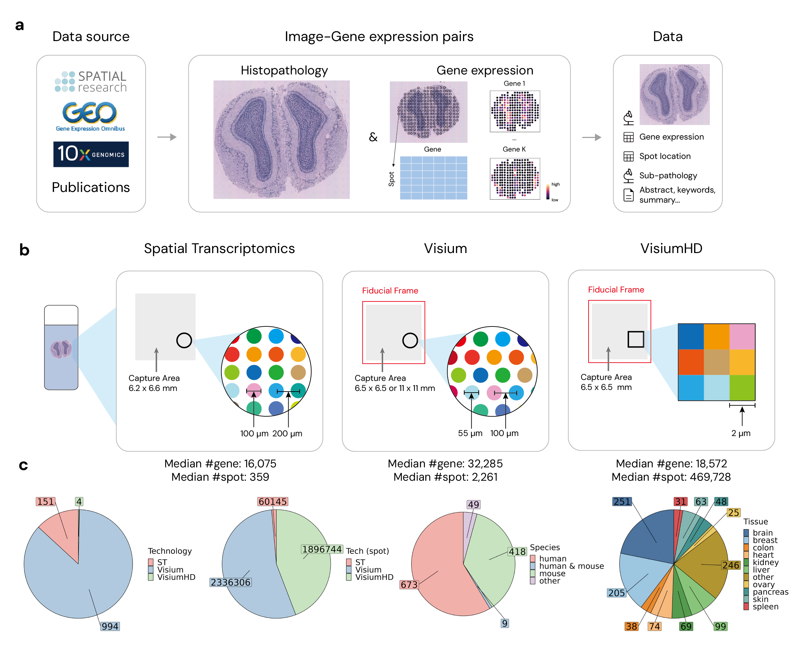

# STimage-1K4M Dataset

Welcome to the STimage-1K4M Dataset repository. This dataset is designed to foster research in the field of spatial transcriptomics, combining high-resolution histopathology images with detailed gene expression data. 




## Dataset Description

STimage-1K4M consists of 1,149 spatial transcriptomics slides, totaling over 4 million spots with paired gene expression data. This dataset includes:

- Images.
- Gene expression profiles matched with high-resolution histopathology images.
- Spatial coordinates for each spot.

See example folder for an example slide from Andersson et al. (pmid: 34650042).

## Getting Started

To use the STimage-1K4M dataset in your research, please fill in this [Google form](https://forms.gle/3Waa4FQnqpK8UGSY7). The request should be processed in 2 business days. Feel free to open an issue or contact us if delayed.


## Data structure
The data structure is organized as follows:

```bash
├── annotation              # Pathologist annotation
├── meta                    # Test files (alternatively `spec` or `tests`)
│   ├── bib.txt             # the bibtex for all studies with pmid included in the dataset
│   ├── meta_all_gene.csv   # The meta information
├── ST                      # Include all data for tech: Spatial Transcriptomics
│   ├── coord               # Include the spot coordinates & spot radius of each slide
│   ├── gene_exp            # Include the gene expression of each slide
│   └── image               # Include the image each slide
├── Visium                  # Include all data for tech: Visium, same structure as ST
├── VisiumHD                # Include all data for tech: VisiumHD, same structure as ST
```
## Repository structure
The [code_reproducibility](code_reproducibility) folder holds the code for data processing and reproducing evaluation result in the paper.

```bash
├── data_collection         # Code for making meta file and checking spot coordinates.
├── data_process            # Code for cropping image to make spot level and gene expression processing.
├── evaluation              # Code for linear-probing and calculate embedding scores.
├── finetune                # Code for fine-tuning CLIP and PLIP models.
```

## Acknowledgement
The fine-tuning and evaluation codes borrows heavily from [CLIP](https://github.com/openai/CLIP/issues/83) and [PLIP](https://github.com/PathologyFoundation/plip/). 

## License

All code is licensed under the MIT License - see the LICENSE.md file for details.
